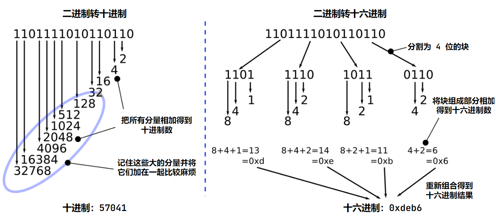
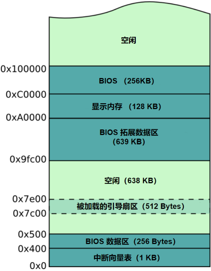

# 从头构建一个简单的操作系统

## 信息

- 原著名：Writing a Simple Operating System - from Scratch (December 2, 2010)

- 原作者：Nick Blundell

- 译者：kaoru

- 邮箱：<a href='mailto:shiina_kaoru@outlook.com'>shiina_kaoru@outlook.com</a>

- 其他：本文档仅供个人学习参考使用

## 目录

1. [**介绍**](#introduction)

2. [**计算机架构与引导过程**](#computer_architecture_and_the_boot_process)

   1. [引导过程](#the_boot_process)

   2. [BIOS，引导块（Boot Blocks）以及魔数（Magic Number）](#bios_boot_blocks_and_the_magic_number)

   3. [CPU 仿真](#cpu_emulation)

      1. [Bochs：一个 x86 CPU 仿真器](#bochs_a_x86_cpu_emulator)

      2. [QEmu](#qemu)

   4. [十六进制计数法](#the_uesfulness_of_hexadecimal_notation)

3. [**引导扇区编程（16 位实模式）**](#boot_sector_programming)

   1. [重新审视引导扇区](#boot_sector_revisited)

   2. [16 位实模式](#16_bit_real_mode)

   3. [Erm, Hello?](#erm_hello)

      1. [中断](#interrupts)

      2. [CPU 寄存器](#cpu_registers)

      3. [整合起来](#putting_it_all_together_1)

   4. [Hello, World!](#hello_world)

      1. [内存、地址和标签](#memory_address_and_labels)

      2. ['X' Marks the Spot](#x_marks_the_spot)

      2. [问题 1](#question_1)

      3. [定义字符串](#defining_strings)

      4. [使用栈](#using_the_stack)

         [问题 2](#question_2)

      5. [控制结构](#control_structures)

         问题 3

      6. 调用函数

      7. 包含文件

      8. 整合起来

         问题 4

      9. 总结

   5. Nurse, Fetch me my Steth-o-scope

      1. 问题 5（进阶）

   6. 读取磁盘

      1. 使用段访问拓展内存

      2. 磁盘是如何工作的

      3. 使用 BIOS 读取磁盘

      4. 整合起来

4. **进入 32 位保护模式**

   1. 适应没有 BIOS 的生活

   2. 理解 GDT（Global Descriptor Table）

   3. 在汇编中定义 GDT

   4. 模式转变

   5. 整合起来

5. **编写、构建并加载你的内核**

   1. 理解 C 的编译

      1. 生成裸机代码

      2. 本地变量

      3. 调用函数

      4. 指针、地址以及数据

   2. 运行我们的内核代码

      1. 编写我们的内核

      2. 创建一个启动扇区以引导我们的内核（Bootstrap）

      3. 找到进入内核的方法

   3. 使用 Make 进行自动化构建

      1. 组织我们的代码库

   4. C 语言

      1. 预处理器和指令

      2. 函数声明和头文件

6. **开发基本设备驱动程序和文件系统**

   1. 硬件 I/O

      1. I/O 总线

      2. I/O 编程

      3. 直接内存访问

   2. 显示驱动

      1. 理解显示设备

      2. 基本显示去驱动的实现

      3. 滚动的屏幕

   3. 处理中断

   4. 键盘驱动

   5. 硬盘驱动

   6. 文件系统

7. **实现进程**

   1. 单进程

   2. 多进程

8. **总结**

9. **参考书目**

<span id="introduction"/>

## 1.介绍

在此之前我们都使用过操作系统（例如 Windows XP，Linux 发行版等），也许我们也编写过一些程序在她们当中运行；但操作系统对于我们而言究竟是什么？当我使用电脑时，有多少工作是由硬件完成的，又有多少工作是由软件完成的呢？电脑又是如何完成工作的？

已故的 Doug Shepherd 教授是我在兰开斯特大学的一位活跃的老师，有一次在我埋怨一些烦人的编码问题，他开展研究前，都会从头构建起一个自己的操作系统。所以在今天，我们想知道这些奇妙的机器是如何在底层工作，以及软件如何将硬件捆绑起来，保证他们日复一日稳定地工作。

我们将集中讨论广泛使用 x86 架构 CPU，随着 Doug 的早期步伐一路学习关于：

- 计算机是如何启动的

- 如何在没有操作系统的情况下，编写在裸机上运行的低级代码

- 如何配置 CPU 以使用它提供的拓展功能

- 如何使用高级语言编写引导代码，然后可以在我们的操作系统上运行程序

- 如何创建基本的操作系统服务，例如设备驱动、文件系统、多任务进程

以上是以操作系统的实际功能而言，本指南的目标是分散的，把信息的片段进行汇总成一个自成一体和连贯的文档，这将给你一个积累底层编程经验的机会，如何编写操作系统，并解决各种各样的问题。本指南所采用的方法是独特的，因为采用了特定的语言与工具（例如汇编、C、Make 等），不过这些并不是重点，而是为达成目的的一种手段。我们将学习对完成目标有用的东西。预先善其事，必先利其器。

这项工作的目的并不是替代，而是为了成为优秀的垫脚石，例如 Minix 项目，以及为了一般的操作系统开发。

<span id="computer_architecture_and_the_boot_process"/>

## 2.计算机架构与引导过程

<span id="the_boot_process"/>

### 2.1 引导过程

现在，开始我们的主要工作。

当我们重新启动计算机，它必须在没有任何操作系统的情况下重新初始化一次。在某种程度上，它必须从当前的某种永久存储介质（软盘、硬盘、U盘等）中将操作系统附加到计算机，而且它并不关心操作系统的种类。

我们简短的讨论一下，在操作系统启动前的环境里（pre-OS environment）提供了很少的服务：在这个阶段，即便是一个文件系统都是奢望（例如在磁盘上读写逻辑文件），我们一无所有。幸运的是，我们拥有基础输入输出软件（Basic Input/Output Software - BIOS），一个从最初的芯片加载到内存当中，并在计算机初始化时运行、提供自动检测和基本控制计算机的基本设备，例如屏幕、键盘和硬盘的软件例程集合。

在 BIOS 完成对硬件的基本测试后，尤其是安装上的内存是否正常工作，它必须启动存在与你设备里的操作系统中的一个。在这里我们应该注意到，BIOS 不能简单地从磁盘中加载你的操作系统文件，因为在 BIOS 中还没有文件系统的概念。BIOS 必须从磁盘设备上的物理位置读取特殊扇区的数据（通常大小为 512 字节），例如 2 号柱面，3号磁头，5号扇区（磁盘寻址的细节将在往后的第 X 节中描述）。

所以，BIOS 的最早的任务就是寻找操作系统所在磁盘的第一个扇区（即 0 号柱面，0 号磁头，0 号扇区），这就是启动扇区。因为我们的磁盘可能不存在有操作系统（比如它们仅为提供额外的存储空间而被连接），那么重要的就是 BIOS 能否确定一个特定的磁盘引导扇区是否存在用于引导操作系统的代码。注意，CPU 不区分代码和数据：它们两者均可被解释为 CPU 指令，代码只是由我们（程序员）精心制作且可用的算法。

BIOS 在这里再次采用了一种简单的方法，将预期引导扇区的最后两个字节设置为魔数 0xAA55。

<span id="bios_boot_blocks_and_the_magic_number"/>

### 2.2 BIOS，引导块（Boot Blocks）以及魔数（Magic Number）

如果我们使用二进制编辑器，例如 TextPad 或 GHex，它们将允许我们写入原始字节至文件中 —— 它们不是标准的文本编辑器，这将会将 ‘A’ 转化为 ASCII 码值，这样我们就可以创建一个简单但是有效的引导扇区。

```
e9 fd ff 00 00 00 00 00 00 00 00 00 00 00 00 00
00 00 00 00 00 00 00 00 00 00 00 00 00 00 00 00
*
00 00 00 00 00 00 00 00 00 00 00 00 00 00 55 aa
```

<center><i> 图 2.1： 以十六进制方式打印的引导扇区机器码 </i></center>

注意，在图 2.1 中，有三点重要的特性：

- 开头的三个字节 0xe9、0xfd、0xff 实际上是机器码，它们被按照 CPU 制造商来定义，执行一个无休止的跳转。

- 最后两个字节 0x55 和 0xaa，它们实际上被标记为一组魔数，这将告诉 BIOS 这是一个正确的引导块，而不是碰巧出现在驱动器上的数据。

- 文件中填充有大量的 0（‘\*’ 表示为省略的零），基本上就是为了将魔数放在 512 字节磁盘扇区的末尾。

一个关于大小端（endianness - 字节序）的重点。你可能想知道为什么神奇的 BIOS 数字先前被描述为 16 位的 0xAA55，但在启动扇区中却被转换为 0x55 和 0xAA。这是因为 x86 架构以小端格式处理多字节值，这与我们的直觉相反 —— 不过，如果我们的系统换了，我的银行账户里有 00000005 英镑，现在我可以退休了，也许还可以捐几英镑给需要帮助的前百万富翁基金会。

编译器和汇编器可以向我们掩盖许多有关字节序的问题，我们可以无视它们来定义数据，比如说，16 位的值会自动序列化为对应的、字节顺序正确的机器码。无论如何，这在某些时候是有用的，尤其是在查找错误时，要确切地知道某个字节将会储存在设备或者内存中的什么位置，所以字节序也是重要的一点。

这些工作可能使得最小化的程序得以在你的计算机上运行，我们可以通过两种方式测试这个程序，有下面两种比较安全、更适合我们的方式：

- 使用当前操作系统允许的方法，将此引导块写入非必需存储设备的第一个启动扇区，然后重新启动计算机。（译者注：这通常需要在 BIOS 中选择优先启动项，就像我们使用 U 盘安装操作系统一样）

- 使用虚拟机，如 VMWare 或者 VirtualBox，将引导块设置为虚拟机的启动镜像，然后启动虚拟机。（译者注：写入镜像的工具推荐 [AloneCafe/fixed-vhd-writer](https://github.com/AloneCafe/fixed-vhd-writer)，这将允许我们向 VHD 中以 LBA 方式写入引导扇区，或者也可以使用译者封装的有较新 GUI 界面的版本 [SHIINASAMA/fixed-vhd-writer](https://github.com/SHIINASAMA/fixed-vhd-writer)）

你应该确保这些代码在你机器重启后被顺利的加载并执行，并且没有出现像 “No operating system found” 这样的错误信息。这就是我们在代码头部所使用的无限循环。如果没有这个循环，CPU 会自动结束程序，在内存中执行每一个后续的指令，其中大部分都是随机的、未被初始化的字节，直至自己进入一些无效的状态，或者重新启动，又或者是偶然运行到一个格式化你主磁盘的程序。

记住，是我们给计算机编程，计算机将会盲目的听从我们的指令，获取并执行，直至关闭为止。所以，我们需要确保它正确执行我们精心编写的代码，而不是让随机字节的数据保存在内存中。在这个底层中，我们对计算机负有很大的权力与责任，所以我们需要学习如何正确的控制它。

<span id="cpu_emulation"/>

### 2.3 CPU 仿真

这是 *第三种* 方案，实际上更方便、更低风险的测试这些低级程序，而不用不断的重启计算机或者冒着被格盘的风险，我们可以使用 CPU 仿真器比如 Bochs 或者 QEmu。（译者注：这里推荐使用 QEmu，这更符合主流的仿真器选择）。这并不像机器虚拟化一样（例如：VMware、VirtualBox），尝试通过直接在 CPU 上运行外部指令来优化性能，从而托管操作系统的使用，仿真器涉及到一个行为类似 CPU 架构的程序，使用变量来表示 CPU 寄存器和高级控制结构，以模拟较低级别的跳转等，所以相对来说它比较慢，但更适合用于开发和调试本指南中这类系统。

注意，为了使仿真器能够做些有效的行动，你需要为它提供一些代码，以便以磁盘镜像文件的方式运行。镜像文件只是一些原始数据（即机器码和数据），否则我们需要将其写入硬盘、软盘、CDROM、U 盘等介质。事实上，一些仿真器将从下载的文件或安装 CDROM 中提取出映像文件，成功地引导和运行真正的操作系统 —— 尽管虚拟化更适合这种使用场景。

仿真器将低级显示设备指令转换为桌面客户端上的像素渲染，所以你可以确切的看到实际上显示器将会渲染的内容。

一般来说，对于本指南中的练习，所有在仿真器中正确运行的代码都可以在真正体系架构的物理实机上正确运行 —— 并且更加的快速。

<span id="bochs_a_x86_cpu_emulator"/>

#### 2.3.1 Bochs：一个 x86 CPU 仿真器

Bochs 要求我们在本地文件内建立一个简单的配置文件 —— bochsrc，它用于描述将被模拟的真实设备的细节（例如你的显示器和键盘），重点是指定哪一个磁盘镜像将在仿真器执行的时候被引导。

图 2.2 展示了一个简单的 Bochs 配置文件以便我们测试写并保存在 XXX 号扇区的文件 —— boot_sect.bin。

```bash
# 告诉 Bochs 将镜像文件视为一个在启动时已经插入计算机的软盘
floppya: 1_44=boot_sect.bin, status=inserted
boot: a
```

<center><i>图 2.2 一个简单的 Bochs 配置文件</i></center>

输入指令以测试我们的引导扇区：

```bash
$bochs
```

做一个简单的实验，尝试将引导扇区末尾的魔数改为无效的值，然后重新运行 Bochs。

由于 Bochs 是对真实 CPU 的模拟，在测试 Bochs 中的代码之后，你应该可以在物理实机上引导它，这会快很多。

<span id="qemu"/>

#### 2.3.2 QEmu

Qemu 与 Bochs 类似，但更高效，也能模拟除了 x86 以外的架构。QEmu 的文档记录不如 Bochs 完善，但不需要配置文件也以意味着 QEmu 更容易运行，指令如下：

```bash
$qemu <你的系统引导镜像文件>
```

<span id="the_uesfulness_of_hexadecimal_notation"/>

### 2.4 十六进制计数法

我们已经见过一些十六进制数的例子，所以重点将是为什么理解十六进制在通常的低级编程中是如此的重要。

首先，考虑一下为什么以十为单位计数对我们来说是如此的自然，这也许有利于理解接下来的内容，因此当我们第一次见到十六进制时会感到疑惑：为什么不直接数到十？我不是这方面的专家，我认为数到十和大多数人的双手共有十根手指有关，这导致了人们使用了十个符号来表示数字：0,1,2,...8,9。

十进制的基数是 10 （即有十个不同的数字符号），但十六进制的基数是 16，所以我们必须发明一些新的数字符号，而最简单的方式就是用几个字母表示，所以我们有了：0,1,2,...8,9,a,b,c,d,e,f，其中字母 d 就代表第 13。

为了区分十六进制和其他数字系统，我们通常使用前缀 0x，或者有时也用后缀 h，这对于碰巧不包含任何字母数字的十六进制尤其重要，例如：0x50 不等于 50（十进制） —— 0x50 在十进制中实际上为 80。

关键来了，计算机用位的序列（即二进制数字）来表示数字，从根本上来说，它的电路只能区分两种电位：0 和 1 —— 就好像计算机总共只有两根手指。因此，为了表示大于 1 的数字，计算机可以将一系列位串在一起，就像我们可以用两个或两个以上的数字（如 456、23 等）来计算高于 9 的数字一样。

我们对一定长度的位序列采用了一些名称，以便讨论和商定我们所处理的数字的大小。大多数计算机的指令处理至少 8 位的值，这些值被命名为字节（byte）。其他的还有 short、int 和 long，它们通常分别表示 16 位、32 位和 64 位的值（译者注：在不少编程语言中，它们也会是类型关键字，但有可能不能对应上 16、32、64 位等，这取决于编译器、操作系统供应商和 CPU 架构等，此处是不考虑这些因素的传统结论）。我们还会看到 word 这个术语，它用于描述 CPU 当前模式的最大处理大小：所以在 16 位的实模式中， word 指的是 16 位的值；在 32 位保护模式下，word 指的是 32 位的值等。

所以转回总结十六进制计数法的好处：位的序列表示起来比较冗长，使用十六进制就更容易记忆与转换（例如从十进制转换）。本质上是因为我们可以转换分解成更小的、4 位的二进制数，而不是试图全用 0 和 1 表示，这对于比较大的字节序列表示起来会更加困难(例如 16、32、64 等)。图 2.3 清楚的表示了十进制转换的困难。



<center><i>图 2.3：将 1101111010110110 转换至十进制和十六进制</i></center>

<span id="boot_sector_programming"/>

## 3.引导扇区编程（16 位实模式）

尽管有了提供的示例代码，你会发现在二进制编辑器中编写机器码非常令人沮丧。你必须记住，或者不断地引用它们，在许多可能的机器码中，是哪一条触发 CPU 执行某些功能。幸运的是，你不是要一个人在战斗，因此我们可以编写汇编程序，可以编写更为人性化的指令，将其转换为针对特定 CPU 的机器码。

<span id="boot_sector_revisited"/>

### 3.1 重新审视引导扇区

现在，我们将使用汇编语言从第 X 节重新创建经过二进制编辑的引导扇区，以便我们能理解像汇编语言这种低级语言的价值。

我们可以将其组装成实际的机器代码（CPU 可以解释为指令的字节序列），如下所示：

```bash
$nasm boot_sect.asm -f bin -o boot_sect.bin
```

其中 boot_sect.asm 是我们在图 3.1 中保存的源代码文件，而 boot_sect.bin 是我们可以将其作为引导扇区安装到磁盘上的汇编机器码。

注意，我们使用了 `-f bin` 选项来指示 nasm 生成原始的机器代码，而不是一个代码包，改代码包具有其它额外的元信息，用于链接我们在更典型的操作系统中编程时使用的其它例程（译者注：即不链接操作系统提供的动态链接库）。我们不需要那种东西。除了低级的 BIOS 例程，我们是这台计算机上唯一运行的软件。现在我们才是操作系统，尽管在这个阶段除了一个无尽循环之外什么都不能提供 —— 但我们很快就会从这个基础上建立起来。

```nasm
;
; 一个无限跳转的简单引导扇区
;

loop:                 ; 定义一个标签 “loop”，这将允许我们无限地跳转回来
    jmp loop          ; 使用一个简单的 CPU 指令以跳转至一个新的内存位置并继续执行
                      ; 在这里，将会跳转指当前位置

times 510-($-$$) db 0 ; 当编译完成，我们的程序必须填充至 512 个字节，
                      ; 并且最后两个字节必须是魔数，
                      ; 所以在此处，告诉汇编器去填充足够的零字节直至第 510 个字节
dw 0xaa55             ; 最后两个字节（即 1 个 word）是魔数，
                      ; 告诉 BIOS 这是一个引导扇区
```

<center><i>图 3.1：一个用汇编编写的简单引导扇区</i></center>

我们可以通过运行 Bochs 来方便地测试这个程序，而不是将它保存到软盘的引导扇区中并重新启动我们的物理机器：

```bash
$bochs
```

或者，根据我们的偏好和模拟器的可用性，使用 QEmu，如下所示：

```bash
$qemu boot_sect.bin
```

或者，你可以将映像文件加载到虚拟化软件中，或者将其写入一些可引导介质中，然后从真正的物理实机上引导它。请注意，当你将映像文件写入某些可引导介质中时，这并不意味这你将文件添加到介质的文件系统中：你必须使用适当的工具，在低级水平上直接写入介质（例如直接写入磁盘的扇区）。

如果我们想更容易地查看汇编程序究竟创建了什么字节，可以运行以下命令，它将以易读的十六进制格式显示文件的二进制内容：

```bash
$od -t x1 -A n boot_sect.bin
```

这个命令的输出应当看起来很熟悉。

恭喜你，你刚刚使用汇编程序编写了一个引导扇区。正如我们将看到的，所有的操作系统都必须以这种方式开始，然后将自己架高到更高级别的抽象中（例如更高级别的语言，如 C/C++）。

<span id="16_bit_real_mode"/>

### 3.2 16 位实模式

CPU 制造商必须尽力使他们的 CPU（即他们特定的指令集）与早期的 CPU 兼容，以便于旧的软件，尤其是操作系统可以运行在最新的 CPU 上。

Intel 兼容 CPU 实现的解决方案是模仿家族中最老的 CPU：Intel 8086，它允许 16 位指令，没有内存保护的概念，内存保护对于现代操作系统的稳定至关重要，因为它允许操作系统限制用户进程访问内核内存，没有它可能会使得一些进程绕过安全机制，甚至导致整个系统崩溃。

因此，为了向后兼容，最重要的是 CPU 最初要以 16 位实模式启动，这要求现代操作系统显式地切换到更高级的 32 位（或 64 位）保护模式，但允许旧的操作系统继续运行，而它们并不知道实际上在使用现代的 CPU 运行。稍后，我们将详细介绍从 16 位实模式到 32 位保护模式这一重要步骤。

一般来说，当我们说一个 CPU 是 16 位的时候，意思是说它的指令最多一次可以使用 16 位。例如：一个 16 位的 CPU 有一个特殊的指令，可以在一个 CPU 周期内将两个 16 位数字相加；如果我们需要两个 32 位数字相加，则需要更多的周期，因为它使用了 16 位的加法。

首先我们将探索这个 16 位的实模式环境，因为所以的操作系统都必须从这里开始，然后我们将看到如何切换到 32 位模式以及这样做的主要好处。

<span id="erm_hello"/>

### 3.3 Erm, Hello?

现在我们将编写一个看似简单的引导扇区程序，它将会在屏幕上打印一个简短的信息。要完成这点，我们必须学习 CPU 如何工作的一些基本原理，以及我们如何使用 BIOS 来帮助操作屏幕设备。

首先我们想一下我们要做什么？我们想在屏幕上打印一个字符，但我们不知道如何与屏幕通信。因为可能有许多种类不同的屏幕设备，它们可能有不同的接口。这就是我们为什么要使用 BIOS，因为 BIOS 已经对硬件进行了一些自动检测，而且很明显，BIOS 会在屏幕上打印自检信息，因此可以为我们提供帮助。

所以，我们想让 BIOS 为我们打印一个字符，但是我们怎么让 BIOS 这样做呢？没有用于打印的 Java 库 —— 它们是个伟大的梦想。不过，我们可以肯定的是，在计算机内存的某个地方，会有一些知道如何写入屏幕的 BIOS 机器码。事实是，我们可能在内存中找到 BIOS 代码，并以某种方式执行它，但这一样很麻烦，而且当不同的机器上的 BIOS 程序存在内部差异时，很容易出错。

这里我们将可以利用计算机的一个基本机制：中断。

<span id="interrupts"/>

#### 3.3.1 中断

中断是一种机制，它允许 CPU 暂停正在做的事情，并在返回原始任务之前允许一些其他的、更高优先级的指令。中断指令可以由软件指令（例如 int 0x10 即中断 0x10）或一些需要高优先级操作的硬件设备引发（例如从网络设备）。

每个中断都由一个唯一的数字表示，该数字是中断向量的索引，中断向量是 BIOS 最初在内存开始处（即物理地址 0x0）建立的表，包含中断服务例程（ISRs）的地址指针。ISR是一个简单的机器指令序列，很像我们的引导扇区代码，处理特定的中断（例如，可能从磁盘驱动器或者网卡读取新数据）。

因此，简单地说，BIOS 将一些自己的 ISR 添加到专门用于计算机某些方面的中断向量中，例如：中断 0x10 导致与屏幕相关的 ISR 被调用；中断 0x13，磁盘相关的 I/0 ISR。

然而，为每个 BIOS 例程分配一个中断是比较浪费的，因此 BIOS 通过我们可以想象为一个大开关的语句（switch）对 ISRs 进行多路复用，通常基于引发中断之前存在 ax 寄存器中的值。

<span id="cpu_registers"/>

#### 3.3.2 CPU 寄存器

如同我们在高级语言中使用变量一样，如果我们能在特定的例程中临时存储数据时很有用的。所以所有的 x86 CPU 都有 4 个通用寄存器：ax、bx、cx 和 dx。

此外，这些寄存器（每个寄存器都可以保存一个 word：大小为两个字节，16 位的数据）可以被 CPU 读写，与访问主存相比，它们的访问延迟可以忽略不计。

在汇编语言中，最常见的操作之一时在这些寄存器之间复制数据：

```nasm
mov ax, 1234  ; 在 ax 中储存十进制数字 1234
mov cx, 0x234 ; 在 cx 中储存十六进制数字 0x234
mov dx, 't'   ; 在 dx 中储存字母 't' 的 ASCII 码
mov bx, ax    ; 将 ax 的值复制至 bx，所以当前 bx 的值为 1234
```

注意，目的地是 mov 的第一个参数而不是第二个，但这种约定俗成随着不同的汇编语言而不同。

有时候处理单个字节更合适，所以这些寄存器允许我们独立设置它们的高低字节：

```nasm
mov ax, 0    ; ax -> 0x0000
mov ah, 0x56 ; ax -> 0x5600
mov al, 0x23 ; ax -> 0x5623
mov ah, 0x16 ; ax -> 0x1623
```

<span id="putting_it_all_together_1"/>

#### 3.3.3 整合起来

回想一下，我们希望 BIOS 为我们在屏幕上打印一个字符，我们可以通过将 ax 设置为某些 BIOS 定义的值，然后触发特定的中断，来调用特定的 BIOS 例程。

我们需要的具体例程是 BIOS 滚动电传打字例程，它将在屏幕上打印单个字符并向前移动光标，为下一个字符做好准备。这里有一个完整的 BIOS 例程列表，给你展示了使用哪个中断以及如何在中断之前设置寄存器。这里我们需要 int 0x10，并将 ah 设置为 0x0e（表示电传打印模式），将 al 设置为我们希望打印的字符的 ASCII 码。

```nasm
;
; 一个使用 BIOS 例程打印信息的简单引导扇区
;

mov ah, 0x0e

mov al, 'H'
int 0x10
mov al, 'e'
int 0x10
mov al, 'l'
int 0x10
mov al, 'l'
int 0x10
mov al, 'o'
int 0x10

jmp $

times 510-($-$$) db 0
dw 0xaa55
```

<center><i>图 3.2</i></center>

图 3.2 向我们展示了完整的扇区启动程序。注意在本例中，我们只需要设置一次 ah，然后只需将 al 设置为不同字符即可。

```
b4 0e b0 48 cd 10 b0 65 cd 10 b0 6c cd 10 b0 6c
cd 10 b0 6f cd 10 e9 fd ff 00 00 00 00 00 00 00
00 00 00 00 00 00 00 00 00 00 00 00 00 00 00 00
*
00 00 00 00 00 00 00 00 00 00 00 00 00 00 55 aa
```

<center><i>图 3.3</i></center>

为了完整起见，图 3.3 显示了这引导扇区的原始机器代码。这些是原始的字节，它们确切地告诉 CPU 要做什么。如果你对编写这样一个几乎没什么用的程序所付出的努力和理解感到惊讶，那么请记住，这些指令与 CPU 电路非常接近，因此它们必然非常简单，但也非常快。现在你开始了解你的电脑，就像它真实的样子。

<span id="hello_world"/>

### 3.4 Hello, World!

现在我们要尝试一个稍微高级一点的 “Hello”程序，介绍更多的 CPU 基础知识，以及对 BIOS 引导扇区进入内存环境的理解。

<span id="memory_address_and_labels">

#### 3.4.1 内存、地址和标签

前面我们说过 CPU 是如何从内存中获取和执行指令，以及 BIOS如何将 512 字节的的引导扇区加载到内存中，然后完成初始化，告诉 CPU 跳转到我们代码的开始，然后开始执行我们的第一条指令，然后是下一条，然后是下一条，等等。

所以我们的引导扇区代码是在内存中的某个位置；但是，他具体再哪？我们可以把主存想象成一个很长的字节序列，可以通过一个地址（即一个索引）单独访问，所以如果我们想知道内存中的第 54 个字节中有什么，那么 54 就是我们将要访问的地址，这通常用十六进制表示起来更加方便：0x36。

所以在我们的引导扇区代码的头部，第一个机器码字节的位置是由 BIOS 将它放在那的。我们可以假设，除非我们知道其他情况， BIOS 在地址 0x0 的内存开始加载我们的代码。不过，事情并不是那么的简单，因为我们知道 BIOS 在加载我们的代码之前就已经在计算机上进行初始化的工作了，并且实际上将继续为时钟、磁盘驱动器等提供硬件中断服务。因此，这些 BIOS 例程（例如 ISRs、用于屏幕打印的服务等）本身必须存储在内存的某个地方，并且必须在它们仍然使用时进行保存（即不能覆盖它）。此外，我们注意到中断向量位于内存的起始位置，如果 BIOS 将我们的代码加载到那，那将会破会中断向量表，并且在下一个中断发生时，计算机可能会崩溃并重新启动：中断号和 ISR 之间的映射实际上已经被切断了。

事实证明，BIOS 总是喜欢将引导扇区加载到地址 0x7c00，因为它肯定不会被重要的例程占用。图 3.4 给出了刚刚加载引导扇区时计算机典型的内存布局示例。因此，虽然我们可以指示 CPU 将数据写入内存中的任何地址，但这可能会导致不好的事情发生，因为一些内存正在被其他程序使用，如计时器中断和磁盘设备。



<center><i>图 3.4：引导后典型的低内存布局</i></center>

<span id="x_marks_the_spot"/>

#### 3.4.2 'X' Marks the Spot

现在我们要玩一个叫做 “找字节” 的游戏，它将演示内存引用，汇编代码中标签的使用，以及知道 BIOS 加载到哪里的重要性。我们将编写一个汇编程序，为一个字符保留一个字节的数据，然后我们将尝试在屏幕上打印出该字符。要做到这一点，我们需要找出它在内存中的绝对位置，这样我们就可以将他加载到 al 中，并让 BIOS 打印它，就像上一个练习一样。

```assembly
;
; 一个演示寻址的引导扇区
;

mov ah, 0x0e

; 尝试 1
mov al, the_secret
int 0x10

; 尝试 2
mov al, [the_secret]
int 0x10

; 尝试 3
mov bx, the_secret
add bx, 0x7c00
mov al, [bx]
int 0x10

; 尝试 4
mov al, [0x7c1e]
int 0x10

jmp $

the_secret:
	db "X"

times 510-($-$$) db 0
dw 0xaa55
```

首先，当我们在程序中声明一些数据时，我们给它加上一个标签（secret）。我们可以在程序中的任何位置放置标签，它们的唯一目的是储存从代码开始到特定指令或数据的偏移。

```
b4 0e b0 1e cd 10 a0 1e 00 cd 10 bb 1e 00 81 c3
00 7c 8a 07 cd 10 a0 1e 7c cd 10 e9 fd ff 58 00
00 00 00 00 00 00 00 00 00 00 00 00 00 00 00 00
*
00 00 00 00 00 00 00 00 00 00 00 00 00 00 55 aa
```

<center><i>图 3.5</i></center>

如果我们查看图 3.5 中生成的机器码，我们可以看到 ‘X’ （ASCII 编码为 0x58） 与代码开始偏移量为 30 （0x1e）字节，就在我们使用 0 填充引导扇区之前。

如果我们运行程序，我们会看到只有后两次尝试成功打印出一个 ‘X’。

第一尝试的问题是它试图将偏移量直接作为要打印的字符，但实际上我们想打印的是偏移地址的上的值而不是偏移本身，就像接下来尝试的那样，方括号指示 CPU 做的这件事 —— 偏移地址的值。

那么为什么第二次尝试是失败的呢？问题在于 CPU 对待偏移就好像是从内存的开始计数（译者注：即基址为 0x0），而不是我们加载代码的开始位置（译者注：即基址 0x7c00），这回使得它实际偏移在中断向量附近。在第三次尝试中，我们将偏移量的基址设置为认为 BIOS 加载了我们代码的地址 0x7c00 上，现在使用 CPU 的加法指令。我们可以把 add 看作是高级语言语句 bx = bx + 0x7c00.现在，我们已经计算出了 ‘X’ 的正确内存地址，使用指令 `mov al, [bx]` 可以将该地址的内容存储在 al 中，为 BIOS 打印功能做好准备。

在第四次尝试中，我们试图做一些优化，在 BIOS 将引导扇区加载到内存后，通过预先计算 ‘X’ 的地址。根据我们之前对二进制代码的检查（参见图 3.5），我们找到了地址 0x7c1e，它表示 ‘X’ 在从引导扇区开始的第 0x1e（30） 个字节。

最后一个例子提醒我们标签存在的意义，因为如果没有标签，我们将不得不从编译的代码中计算偏移量，然后在代码中更改这些偏移量。

现在我们已经了解了 BIOS 如何将引导扇区加载到 0x7c00，还了解了寻址和程序集标签之间的关系。

总是要考虑标签 —— 内存偏移，着在你的代码中是不方便的，使用很多汇编程序将在汇编期间纠正标签引用，在代码顶部包括以下指令，告诉汇编器你希望代码被加载在的确切位置：

```assembly
[org 0x7c00]
```

<span id="question_1"/>

#### 问题 1

当 org 指令被添加到这个引导扇区的时候，你认为将会打印出什么？为了获得好分数，请解释为什么会这样。

<span id="defining_strings"/>

#### 3.4.3 定义字符串

假设你想在某一时刻打印一个预定义的消息（例如： “Booting OS”）到屏幕上；如何在汇编程序中定义这样的字符串？注意，计算机对不知道什么是字符串，字符串只是保存在内存某个地方的数据单位（例如字节、字等）的序列。

在汇编语言中，我们可以使用下面的方式定义一个字符串：

```assembly
my_string:
	db 'Booting OS'
```

我们可以看到 `db`，它翻译为 “声明字节数据”，告诉汇编程序将后续字节直接写入二进制输出文件（即不将其解释为处理器指令）。由于我们用引号包围了数据，汇编程序知道将每个字符串转换为它的 ASCII 字节码。注意，我们通常使用标签（例如：my_string）来标记数据的开始，否则我们将无法在代码中引用它。

在这个例子中，我们忽略了一件事：知道字符串的长度和知道它在哪里同样重要。因为我们必须编写所有处理字符串的代码，所以有一个一致的策略来知道字符串的长度是很重要的。有几种方案，惯例是将字符串声明为以空结尾，这意味着我们总是将字符串的最后一个字节声明为 0，就像这样：

```assembly
my_string:
	db 'Booting OS', 0
```

在之后遍历字符串，需要依次打印字符串的每个字符时，我们便可以很简单的确定字符串何处结束。

<span id="using_the_stack"/>

#### 3.4.4 使用栈

当谈及计算机底层时，我们经常听到人们谈论栈，就好像这是什么特别的东西。栈实际上只是一种应对以下情况的简单解决方案：CPU 有有限个寄存器用于临时存储例程的局部变量，但我们经常需要比这更大的临时储存空间。显然，我们可以使用主存，但是在读写特定内存地址时是不方便的，特别是不再关心数据具体储存在哪时，我们必须能够足够容易的检索它。正如我们稍后将看到的，堆栈对于参数传递来实现函数的调用也很有用。

所以说，CPU 提供了两个指令 `push` 和 `pop` ，分别允许我们存储一个值和从栈顶检索一个值，这样就不用担心它们被储存在哪里了。但是请注意，我们不能将单个字节推入或弹出堆栈：在 16 位模式下，堆栈仅在 16 位边界（0 ~ 65535）下工作。

<span id="question_2"/>

#### 问题 2

图 3.6 中的代码将按照什么顺序进行打印？ASCII 字符 ‘C’ 存储在哪个绝对内存地址？你可能会发现修改代码以确认你的想法是有用的，一定要明白为什么是这个地址。

<span id="control_structures"/>

#### 3.4.5 控制结构
